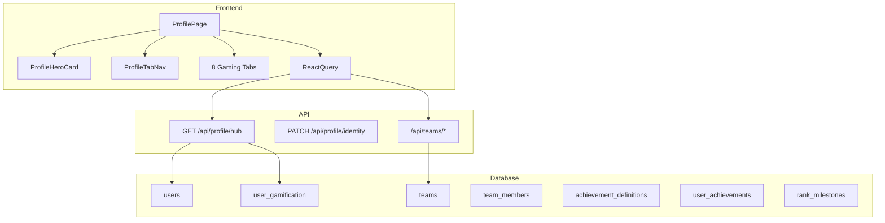

# Credo W — Profile Identity System

Premium gaming + fintech identity layer for ambassadors.

## Architecture Overview



## Database Setup

Run in Supabase SQL Editor (after main schema):

```
server/src/db/phase-profile-identity.sql
```

Creates: `teams`, `team_members`, `team_invitations`, `user_gamification`, `achievement_definitions`, `user_achievements`, `rank_milestones`.

## API Structure

| Method | Route | Purpose |
|--------|-------|---------|
| GET | `/api/profile/hub` | Aggregated identity: user, BV, gamification, team, achievements, wallets |
| PATCH | `/api/profile/identity` | Public profile toggle, banner URL |
| GET | `/api/teams/leaderboard` | Top teams by power_score |
| GET | `/api/teams/browse` | Public team list |
| GET | `/api/teams/mine` | Current user's team + roster |
| POST | `/api/teams` | Create team (franchise/admin/super_admin) |
| POST | `/api/teams/join` | Join team by `team_id` |
| POST | `/api/teams/leave` | Leave current team |

## Gamification Logic

- **XP**: `PV×8 + matching_BV×2 + directs×60 + commission×0.5`
- **Level**: Threshold ladder (500, 1200, 2500, …)
- **Prestige**: Derived from rank `sort_order`
- **Scores**: Power, Network, Referral (computed on each hub sync)
- **Achievements**: Auto-evaluated on hub load; persisted in `user_achievements`

## Team Rules

- One team per user (`team_members.user_id` UNIQUE)
- Founders: `franchise`, `admin`, `super_admin` can create teams
- Leader cannot leave while other members exist
- Leaderboard ranked by `power_score` = `total_bv×1.2 + members×50`

## React Component Tree

```
src/pages/profile/
  ProfilePage.jsx
  components/
    ProfileParticles.jsx
    ProfileHeroCard.jsx
    ProfileTabNav.jsx
    ProfileStatCard.jsx
    tabs/
      ProfileOverviewTab.jsx   (+ social/referral)
      ProfileTeamTab.jsx
      ProfileAchievementsTab.jsx
      ProfileWalletsTab.jsx
      ProfilePackagesTab.jsx
      ProfileActivityTab.jsx
      ProfileRewardsTab.jsx
      ProfileSecurityTab.jsx
      ProfileSocialTab.jsx
```

## Tabs

1. **Overview** — Stats, identity edit, BV, referral/social
2. **Team** — Clan card, roster, leaderboard, join/create
3. **Achievements** — Badges, XP, streak, rank timeline
4. **Wallets** — Earnings, C Money, Pearls quick access
5. **Packages** — Membership tier display
6. **Activity** — Recent wallet transactions
7. **Rewards** — Streak + earnings module links
8. **Security** — Password + C Money PIN

## Mobile UX

- Horizontal swipe tab bar (`overflow-x: auto`)
- Stacked hero layout under 640px
- Touch-friendly stat cards (2-column grid)
- `100dvh`-safe shell via existing `app-content`

## Production Checklist

- [ ] Run `phase-profile-identity.sql` on Supabase
- [ ] Verify `current_package_level` column exists (`phase-d-package-upgrades.sql`)
- [ ] Set `CLIENT_ORIGIN` in server `.env` for referral URLs
- [ ] Optional: add real QR library (`qrcode.react`) for referral card
- [ ] Optional: team logo/banner upload via storage (same as avatars)
- [ ] Optional: public profile route `/p/:share_slug` for visitors
- [ ] Record rank milestones on rank promotion job (cron)

## Dependencies Added

- `framer-motion` — hero animations, tab transitions, stat cards
